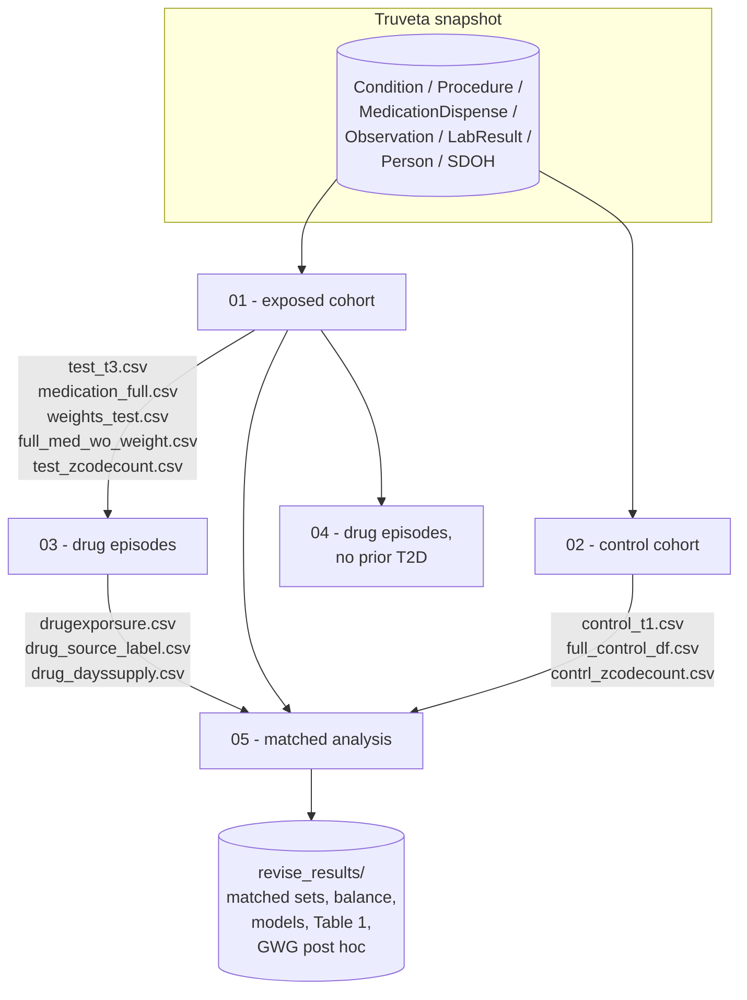

# Gestational weight gain and pregnancy outcomes with semaglutide exposure

Analysis code for a retrospective cohort study in the **Truveta** electronic
health record database, comparing gestational weight gain (GWG) and pregnancy
outcomes across people who continued semaglutide into pregnancy, stopped before
pregnancy, or never used it.

**Published as:** Yu Y, Li X, Groth SW, Zaman A, Chao AM, Phelan S, Hollenbach SJ,
Dreisbach C. Gestational weight gain and pregnancy outcomes after semaglutide
exposure. *Obstet Gynecol*. 2026;148(2):229–237.
doi:[10.1097/AOG.0000000000006325](https://doi.org/10.1097/AOG.0000000000006325)

> **These notebooks only run inside Truveta Studio.** They depend on the
> `truveta.study` SDK, a live Spark session and the Truveta data snapshot. There
> is no local dataset in this repository and none can be created — Truveta data
> is not redistributable. Nothing here will execute on a laptop; the code is
> published so the study can be read, reviewed and re-run *by someone with
> Truveta access*.

---

## Study design

Deliveries are identified from delivery condition and procedure codes and dated
from ICD-10 `Z3A.*` pregnancy Z-codes, which give the estimated last menstrual
period (LMP) and therefore gestational age. Semaglutide dispensing records are
chained into treatment episodes, and each pregnancy is classified by whether
treatment coverage overlapped it. GWG is the difference between the last weight
before delivery and the last weight around the LMP, categorised against the
IOM/NASEM 2009 recommendations for the person's pre-pregnancy BMI. Exposure
groups are then compared pairwise using 1:1 propensity-score matching with
covariate-adjusted outcome models.

### Exposure groups

| Group | Definition |
|---|---|
| `continued_user` | Semaglutide coverage overlapped the pregnancy (any trimester) |
| `former_user` | Semaglutide before pregnancy only, no in-pregnancy coverage |
| `non_user` | Control cohort — no semaglutide and no bariatric surgery |

People who **initiated** semaglutide during pregnancy are excluded: they have no
pre-pregnancy treatment window and fit neither exposed definition.

A parallel bariatric-surgery arm (`source_type == "surgery"`) is carried through
cohort construction and appears in descriptive tables, but is not part of the
matched comparisons.

### Outcomes

| Type | Outcomes |
|---|---|
| Primary (continuous) | `gestation_weight` — total gestational weight gain, kg |
| Primary (binary) | `gwg_excessive_flag` — GWG above the IOM/NASEM recommended range |
| Secondary (binary) | incident gestational diabetes, pregnancy-related hypertension (gestational hypertension or preeclampsia), excessive fetal weight, intrauterine growth restriction, caesarean delivery, preterm birth (< 37 weeks) |

---

## Repository layout

```
.
├── README.md
├── requirements.txt              # package versions, for reference
├── notebooks/                    # the pipeline — run in numeric order
│   ├── 01_cohort_exposed.ipynb
│   ├── 02_cohort_control.ipynb
│   ├── 03_drug_episodes.ipynb
│   ├── 04_drug_episodes_no_prior_t2d.ipynb
│   └── 05_matched_analysis.ipynb
├── src/
│   └── truveta_helpers.py        # reference copy of the shared helper functions
├── docs/
│   ├── variables.md              # data dictionary
│   └── cleanup-notes.md          # what changed vs. the original notebooks
└── archive/
    └── original_notebooks/       # the notebooks exactly as they came out of Truveta
```

Every notebook is **self-contained**: it re-defines the helper functions it
needs, so a single `.ipynb` can be uploaded to a Truveta workspace and run on
its own. `src/truveta_helpers.py` is the single readable copy of those shared
helpers — if you change a helper there, mirror it in the notebooks, and vice
versa.

---

## Pipeline



### Run order and data flow

| # | Notebook | Reads | Writes |
|---|---|---|---|
| 01 | `01_cohort_exposed.ipynb` | Truveta snapshot | `test_t3.csv`, `weights_test.csv`, `medication_full.csv`, `full_med_wo_weight.csv`, `test_zcodecount.csv` |
| 02 | `02_cohort_control.ipynb` | Truveta snapshot | `control_t1.csv`, `control_df.csv`, `contrl_zcodecount.csv`, `full_control_df.csv` |
| 03 | `03_drug_episodes.ipynb` | `medication_full.csv`, `test_t3.csv` | `drug_dayssupply.csv`, `drug_source_label.csv`, `drugexporsure.csv`, two summary tables |
| 04 | `04_drug_episodes_no_prior_t2d.ipynb` | `medication_full.csv`, `test_t3.csv` | `revise_results/drugexposurenot2d.csv` |
| 05 | `05_matched_analysis.ipynb` | all of the above | everything under `revise_results/` |

All paths are relative to `study.get_output_path(fs=True)`. Notebooks 03 and 04
are independent of each other; 04 is a sensitivity subgroup and can be skipped
without affecting notebook 05.

---

## Re-running the study

1. Open a Truveta Studio workspace with access to the study and its `Delivery`
   population.
2. Upload the five notebooks from `notebooks/`.
3. Check the **CONFIG** cell near the top of each notebook. Everything a
   re-runner is likely to change lives there: population title, code set URLs,
   date cutoffs, gestational-age bounds, weight windows, the 60-day treatment
   gap, and every input/output filename. Nothing below the CONFIG cell needs
   editing for a routine re-run.
4. Run notebooks in numeric order, top to bottom.
5. Results land in `revise_results/` inside the study output path.

Sections headed **Appendix** at the bottom of a notebook are superseded
approaches, kept commented out for provenance. They are not part of the pipeline
and should not be run.

### Runtime notes

* Notebook 02 is by far the slowest — it processes the full delivery population.
  Its weight-window join is written in PySpark for that reason; notebook 01 uses
  an equivalent pandas loop because the exposed cohort is small.
* Notebooks 03 and 04 loop over people in Python to build treatment episodes.
  This is intentionally simple rather than fast.
* `!pip install tableone` appears in the notebooks because `tableone` is not
  preinstalled in the Truveta image.

---

## Key definitions

**Gestational age.** ICD-10 `Z3A.*` codes state the week of gestation at an
encounter. For each delivery, the Z-code encounter closest to the delivery (and
no more than 300 days before it) is used to back-calculate the estimated LMP.
Gestational age at delivery is then `delivery_date − estimated_LMP`, restricted
to 24–42 weeks; preterm is `< 37` weeks.

**Gestational weight gain.** `predelivery_weight − prepreg_weight`, where
`prepreg_weight` is the measurement closest to the estimated LMP within ±12
weeks, and `predelivery_weight` is the measurement closest to delivery within
the preceding 4 weeks. Both are required; deliveries missing either are excluded
from the main analysis and examined in the missing-weight sensitivity analysis
(notebook 05, section 13).

Weights arrive with inconsistent units. Where the unit is recorded it is used;
where it is missing the unit is inferred from the value's magnitude, then
everything is converted to pounds and finally kilograms, with values outside
90–700 lb discarded as implausible.

**GWG category.** IOM/NASEM 2009: a first-trimester allowance of 0.5–2.0 kg
plus a BMI-specific weekly rate applied from week 13 onwards. Observed GWG below
the range is `Inadequate`, within it `Adequate`, above it `Excessive`.

**Treatment episodes.** Semaglutide fills are chained into one episode while the
gap between the previous fill's days-supply end date and the next fill is
≤ 60 days. A longer gap starts a new episode and counts as a discontinuation; a
fill after such a gap counts as a reinitiation.

**Prescribing indication.** Inferred from the brand dispensed: Ozempic and
Rybelsus → diabetes, Wegovy → obesity.

---

## Statistical methods

* **Matching.** Logistic propensity score on age at delivery, race/ethnicity,
  pre-pregnancy BMI, pre-pregnancy type 2 diabetes and pre-pregnancy
  hypertension. Greedy 1:1 nearest-neighbour matching without replacement on the
  logit of the propensity score, caliper = 0.2 × SD(logit PS).
* **Balance.** Absolute standardised mean differences on the propensity-score
  design matrix; `< 0.1` is taken as adequate. Reported per comparison in
  `<comparison>_balance.csv` and summarised as `max_smd` in
  `pairwise_summary.csv`.
* **Outcome models.** On the matched set: logistic regression for binary
  outcomes, OLS for continuous ones, adjusted for the propensity-score
  covariates plus income, parity, depression, prior caesarean and prior preterm
  birth. `t2d_before_pregnancy` is dropped from the gestational-diabetes model
  and `hyper_before_pregnancy` from the hypertensive models, because those
  outcomes are defined as incident (no prior diagnosis) and the covariate would
  be constant. Logistic fits fall back to a binomial GLM if they fail to
  converge; every skipped or failed model is logged in
  `all_model_status_summary.csv` rather than silently dropped.
* **Minimally adjusted models.** The same matched sets with only prior caesarean
  and prior preterm birth as covariates (notebook 05, section 10).
* **GWG post hoc.** Chi-square on the 2 × 3 group × GWG-category table, with
  standardised residuals and Holm-adjusted two-proportion z-tests per category.

---

## Environment

See `requirements.txt`. The analysis stack is standard scientific Python —
`pandas`, `numpy`, `statsmodels`, `scikit-learn`, `scipy`, `matplotlib`,
`tableone` — on top of the Truveta SDK and `pyspark`. Package versions come from
the Truveta Studio image and are not pinned by this repository.

## Citation
@article{yu2026gwg,
  author  = {Yu, Yang and Li, Xintong and Groth, Susan W. and Zaman, Adnin and
             Chao, Ariana M. and Phelan, Suzanne and Hollenbach, Stefanie J. and
             Dreisbach, Caitlin},
  title   = {Gestational Weight Gain and Pregnancy Outcomes After Semaglutide Exposure},
  journal = {Obstetrics \& Gynecology},
  year    = {2026},
  volume  = {148},
  number  = {2},
  pages   = {229--237},
  doi     = {10.1097/AOG.0000000000006325}
}

## Data availability

No patient-level data, extracts, or intermediate outputs are stored here. All
data remains inside the Truveta environment. The CSV files named throughout are
written to, and read from, the study output path in that environment.

## Further reading in this repo

* [`docs/variables.md`](docs/variables.md) — data dictionary for the cohort files
